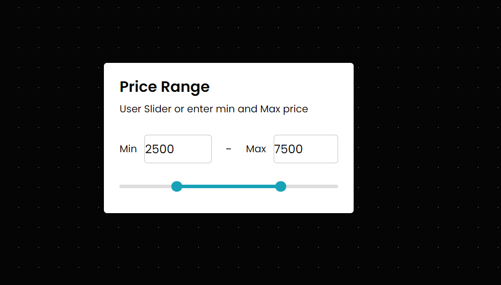

# Price Range Slider with Min-Max Input

This project is a responsive price range slider built using HTML, CSS, and JavaScript. It allows users to select a price range by either using the slider or manually entering the minimum and maximum values. The slider visually represents the selected range and adjusts dynamically based on user input.

## Features

- Users can set a minimum and maximum price using input fields.
- The slider provides a visual representation of the selected price range.
- The range can be adjusted by dragging the slider handles or by entering values directly.
- The slider ensures that the minimum price does not exceed the maximum price and vice versa.
- Dynamic progress bar that updates as the slider handles are moved.

## How It Works

- Users enter a minimum and maximum price in the input fields, or adjust the slider to set the desired range.
- The progress bar visually indicates the selected range on the slider.
- The input fields and slider are synchronized, so changing one automatically updates the other.
- The minimum difference between the selected prices is enforced to ensure a valid range.

## Screenshot

## Technologies Used

- **HTML**: For the structure of the slider and input elements.
- **CSS**: For styling the slider, input fields, and progress bar.
- **JavaScript**: For handling user input, synchronizing the slider with input fields, and ensuring the integrity of the selected price range.
